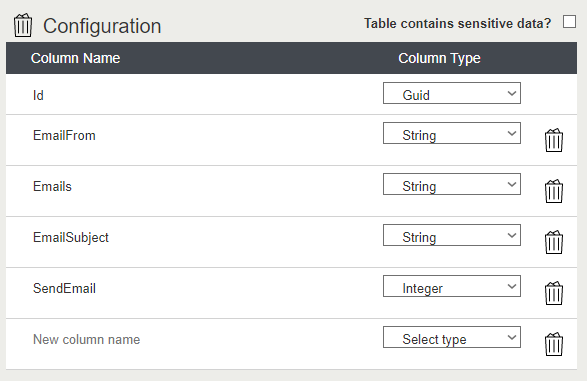
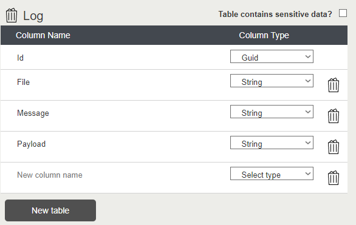

# Arcadier-CustomLogger Description
Plugin to store own logs for custom plugins. 

It contains public endpoint that accept HTTP request in order to use it from JS files. Also this can be implemented from other PHP files.

> You can also use this repo as Arcadier plugin base template.

# File structure
The file structure of each Plug-in's source code:

>
    ├── admin                    
        ├── ADevTools
            ├── CustomLog
        ├── html
        ├── css
        └── scripts                
        └── php files                
    ├── user                   
        ├── html
        ├── css
        └── scripts 
        └── php files 

> admin folder contains the part of the code that executes for the marketplace administrator. 

> user folder has the code that executes for the merchants and buyers.

<br>

# Custom Tables

First you need to configure in Arcadier's Developer Dashboard some Custom Tables:


## Configuration

Column Name   | Column Type   | Description 
------------- | ------------- | -------------
**Id**        | **Guid**      | Arcadier unique identifier.
EmailFrom     | String        | Email from you are going to receive the email.
Emails        | String        | Emails who will receive the error.(separated by comma)
EmailSubject  | String        | Email Subject.
SendEmail     | Integer       | 0 - not send email <br> 1 - to send email

**Once table is defined please create only one configuration using the arcadier's api.**
<br>

Should look like this

<br>



## Log

Column Name   | Column Type   | Description 
------------- | ------------- | -------------
**Id**        | **Guid**      | Arcadier unique identifier.
File          | String        | File name who is generating the error.
Message       | String        | Message that you want to log into the table
Payload       | String        | JSON payload to be store

<br>

Should look like this

<br>



<br>

# How to use public endpoint

**Endpoint Url**

``` Endpoint
https://{{your-marketplace}}.arcadier.io/user/plugins/{{plugin-ID}}/Logger.php
```

Column Name   | Required      | Description 
------------- | ------------- | -------------
Message       | YES           | Descriptive error message.
FileName      | NO            | File name who invoke the method 
Payload       | YES           | JSON payload to be store 
EmailBody     | NO            | Email body that you want to send also the flag in the configuration table should be enable (1)

<br>

Request Payload
```json
{
    "Message": "message error to log",
    "FileName": "xyz.php",
    "Payload": {
        "prop1": "something",
        "prop2": "something prop 2",
        "prop3": 777,
        "prop4": "something prop 4",
        "prop5": 100
    },
    "EmailBody": "<p>Some error happen during test</p>" 
}
```
Response result
```text
"{\"Result\" : true }"
```

JS example request
```javascript
var settings = {
  "url": "https://{{your-marketplace}}.arcadier.io/user/plugins/{{plugin-ID}}/Logger.php",
  "method": "POST",
  "timeout": 0,
  "headers": {
    "Content-Type": "application/json"
  },
  "data": JSON.stringify({
    "Message": "message error to log",
    "FileName": "xyz.php",
    "Payload": {
        "prop1": "something",
        "prop2": "something prop 2",
        "prop3": 777,
        "prop4": "something prop 4",
        "prop5": 100
    },
    "EmailBody": "<p>Some error happen during test</p>" 
}),
};

$.ajax(settings).done(function (response) {
  console.log(response);
});
```

<br>

# Implementing in user side

Create a new PHP file and add the next statement.

```php
include('../admin/ADevTools/CustomLog/CustomLogger.php');

$customLogger = new CustomLogger('CLIENT ID','CLIENT SECRET');// credentials from your marketplace

$customLogger->Log($Payload, $Message, $FileName, $EmailBody);
```

<br>

# Implementing in admin side

Create a new PHP file and add the next statements.

```php
include('ADevTools/CustomLog/CustomLogger.php');

$customLogger = new CustomLogger('CLIENT ID','CLIENT SECRET');// credentials from your marketplace

$customLogger->Log($Payload, $Message, $FileName, $EmailBody);
```
<br>

# How to install plugin in Arcadier Developer Dashboard
1. Download repository.
2. Compress (.zip) the admin and user folder. 
3. Login to Arcadier Plug-in Developer Dashboard.
4. Create a new Plug-in.
5. Create custom tables and custom field (if needed).
6. Upload .zip file in the created Plug-in.
7. Login into your marketplace admin portal.
8. Go to Plug-in
9. Search for the Plug-in and install it.